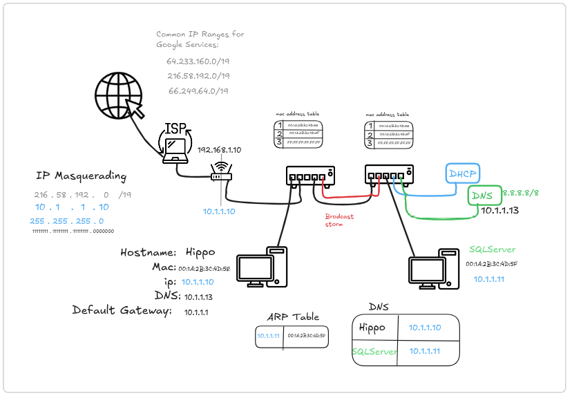
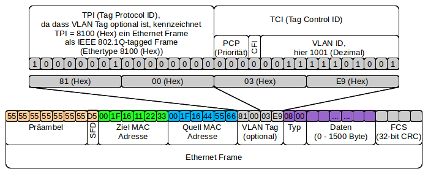
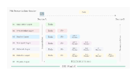
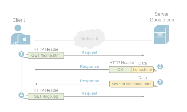
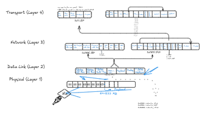
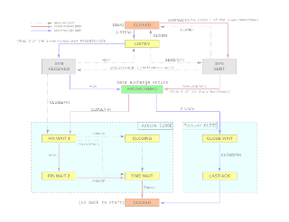

This project has been created as part of the 42 curriculum by ehamza.
# Network Basics Overview

#### Physical vs Logical Addressing
Every device has a **MAC address**, a unique hardware identifier used for communication inside a local network. Since **MAC addresses** are not practical for large-scale networks, **IP addresses** are used as logical and flexible identifiers. The **Subnet Mask** determines whether a destination is local or remote. Remote traffic is forwarded to the **Default Gateway**.

---
#### ARP and DHCP
While applications use **IP addresses**, network hardware operates with **MAC addresses**. **ARP (Address Resolution Protocol)** resolves an **IP address** to its corresponding **MAC address** and stores the result in an **ARP table** for faster future access.  
To simplify configuration, **DHCP** automatically assigns **IP addresses** and essential network settings to devices for a limited time.

---
#### Local vs Remote Communication
**ARP** is limited to the local network. If a destination lies outside the subnet, the device resolves the **MAC address of the Default Gateway** and sends the traffic to it for further routing.

---
#### DNS
**DNS (Domain Name System)** maps stable, human-readable **hostnames** to **IP addresses** that may change over time due to **DHCP**. When a device connects, **DHCP** provides both an **IP address** and the **DNS server** address. Communication follows this chain:  
``Hostname → DNS → IP  → ARP → MAC``  
Local **hostnames** are resolved internally, while external domains are forwarded to public DNS servers.

``8.8.8.8`` is a **public DNS server** used when your local **DNS** cannot resolve a domain. Your computer asks its **DNS server** (given by **DHCP**), which forwards the request to ``8.8.8.8``. Google’s **DNS** resolves the **hostname** into an **IP address** and sends it back, allowing communication to continue.

---
#### ISP and Router (Default Gateway)
The **ISP** provides your connection to the internet and assigns your router a **public IP address**. Inside your network, devices use **private IPs** that cannot be reached directly from the internet.  

The **router**, also called the **default gateway**, forwards traffic that leaves the local network. Local traffic stays within the subnet, but if a destination is remote, the computer sends packets to the router’s **MAC address**, letting the router handle the rest.  

Through **NAT (masquerading)**, the router replaces the devices’ private IPs with its public IP when sending traffic to the internet. Responses return to the router, which then delivers them to the correct device. Most of the router’s configuration is handled by the **ISP**, keeping the process simple for the user.

#### VLANs (Virtual Local Area Networks)

**VLANs** separate networks logically, creating "virtual switches" inside a physical switch to improve **security** and limit **broadcast traffic**. Packets are tagged with a **VLAN ID (802.1Q)**, and switches enforce boundaries by discarding packets sent to the wrong VLAN. Ports can be **Access (untagged)** for standard devices, where the switch handles tagging automatically, or **Trunk (tagged)** for connecting switches or VLAN-aware servers, preserving VLAN tags. Servers can participate in multiple VLANs using **virtual interfaces** (e.g., ``eth0.2``, ``eth0.3``) with separate IPs. Basic switches assign VLANs by port, while smart or industrial switches can follow devices via **MAC address** or **user login** to maintain consistent VLAN membership.

*VLANs tag packets with a VLAN ID and discard them if the destination is on a different VLAN, isolating devices and controlling communication even on the same physical switch.*

# Anatomy of Network-Packets

### How Data Flows in the OSI Model*?*

When we transfer information from one device to another, it travels through 7 layers of OSI model. First data travels down through 7 layers from the sender's end and then climbs back 7 layers on the receiver's end. Data flows through the OSI model in a step-by-step process:

- ****Application Layer:**** Applications create the data.
- ****Presentation Layer:**** Data is formatted and encrypted.
- ****Session Layer:**** Connections are established and managed.
- ****Transport Layer:**** Data is broken into segments for reliable delivery.
- ****Network Layer:**** Segments are packaged into packets and routed.
- ****Data Link Layer:**** Packets are framed and sent to the next device.
- ****Physical Layer:**** Frames are converted into bits and transmitted physically.

---
### 1. Application Layer

The Application Layer sits at the very top of the OSI model, acting as the primary window for users and application services to access the network. Implemented by network applications, this layer is responsible for producing the data to be transferred and displaying the received information back to the user. It is important to note that software applications, such as web browsers, do not reside in this layer themselves; instead, they leverage Application Layer protocols—like **Http**, **SMTP**, **FTP**, and **DNS**—to enable the actual network communication.

- #### Standard Ports and Services
The following table outlines widely used Application Layer protocols, associating them with their designated port numbers and primary networking functions.

| Protocol                                       | Port Number(s)                 | Description                                                                                                                                       |
| ---------------------------------------------- | ------------------------------ | ------------------------------------------------------------------------------------------------------------------------------------------------- |
| **Domain Name System** (DNS)                   | 53                             | Translates internet names to their globally registered IP addresses. For example, “google.com” is registered in global DNS as IP address 8.8.8.8. |
| **Hypertext Transfer Protocol Secure** (HTTPS) | 443                            | Sends data to and from web browsers and web servers, but securely with the Secure Socket Layer (SSL) protocol.                                    |
| **File Transfer Protocol** FTP                 | 20, 21                         | Transfers files from a client to a server and vice versa.                                                                                         |
| **Secure Shell** (SSH)                         | 22                             | Connects to computers remotely and in a secure, encrypted way.                                                                                    |
| **Simple Mail Transfer Protocol** (SMTP)       | 25                             | Sends and receives email.                                                                                                                         |
| **Dynamic Host Configuration Protocol** (DHCP) | 67                             | Automatically assigns IP addresses to devices on a network.                                                                                       |
| **Internet Relay Chat** (IRC)                  | 194                            | Used in a client/server method. IRC clients communicate through an IRC server.                                                                    |
| **Post Office Protocol 3** (POP3)              | 110 (unsecured), 995 (secured) | Used for email where the client receives mail by downloading it locally to a computer from a server mailbox.                                      |

- #### HTTP
You can see that HTTP is **a client-server, request-response** protocol. A web browser sends a request like `GET` or `POST`. The server answers with a status code and the web page content.

Here’s what happens in more detail:
- **Request (GET):** Your web browser sends an HTTP message to the web server. The message includes an HTTP header that says, *“GET /home.html.”* If no file name is given, the server assumes you want the default page.
- **Response (OK):** The server replies with another HTTP message. The header includes a return code like HTTP 200 OK, meaning the request was successful. If there’s an error (for example, page not found), the code might be 404 Not Found instead.
- **Data Transfer:** The server may send multiple messages containing parts of the requested file. To save space, only the first message includes an HTTP header; the rest just carry data.
- **Request (GET):** After opening the homepage, you most likely click on a link that leads you to another internal page. Subsequently, your web browser sends another request for that page. The server responds with the page, and so on.

---
### 2. Presentation layer

The[Presentation Layer](https://www.geeksforgeeks.org/computer-networks/presentation-layer-in-osi-model/) is also called the Translation layer. The data from the application layer is extracted here and manipulated as per the required format to transmit over the network. Protocols used in the Presentation Layer are [TLS/SSL](https://www.geeksforgeeks.org/computer-networks/difference-between-secure-socket-layer-ssl-and-transport-layer-security-tls/) (Transport Layer Security / Secure Sockets Layer).[JPEG, MPEG, GIF](https://www.geeksforgeeks.org/computer-graphics/difference-between-jpeg-and-mpeg/), are standards or formats used for encoding data, which is part of the presentation layer’s role.

- #### Functions of the Presentation Layer
    - ****Translation:**** For example, [ASCII to EBCDIC](https://www.geeksforgeeks.org/computer-organization-architecture/difference-between-ascii-and-ebcdic/).
    - ****Encryption/ Decryption:**** Data encryption translates the data into another form or code. The encrypted data is known as the ciphertext, and the decrypted data is known as plain text. A key value is used for encrypting as well as decrypting data.
    - ****Compression:**** Reduces the number of bits that need to be transmitted on the network.

---
### 3. Session layer 

[Session Layer](https://www.geeksforgeeks.org/computer-networks/session-layer-in-osi-model/) in the OSI Model is responsible for the establishment of connections, management of connections, terminations of sessions between two devices. It also provides authentication and security. Protocols used in the Session Layer are NetBIOS, PPTP.

- #### Functions of the Session Layer
    - **Session Establishment, Maintenance, and Termination:**The layer allows the two processes to establish, use, and terminate a connection.
    - ****Synchronization:**** This layer allows a process to add checkpoints that are considered synchronization points in the data. These synchronization points help to identify the error so that the data is re-synchronized properly, and ends of the messages are not cut prematurely, and data loss is avoided.
    - ****Dialog Controller:**** The session layer allows two systems to start communication with each other in half-duplex or full duplex.
---
### 4. Inside a Network Packet
In this diagram, I explain the anatomy of network packets by breaking down how data is encapsulated as it moves through the network stack, showing the role of headers, addresses, flags, and control fields at each layer, and how switches and routers use this information to forward, filter, or discard packets during transmission.

- #### Why use TCP over UDP
ou use TCP over UDP when your application requires a reliable communication channel on top of the unreliable underlying network, because unlike UDP which ignores lost or out-of-order data, TCP guarantees that packets arrive and are reassembled in the correct sequence through a system of acknowledgments and sequence numbers

- #### TCP Connection Lifecycle Overview

TCP connections follow a well-defined **state diagram** that controls how connections are **established**, **maintained**, and **terminated**. A connection starts with the **three-way handshake**: the client sends a **SYN** to request communication, the server replies with **SYN-ACK** to acknowledge and synchronize, and the client responds with a final **ACK**, after which both sides enter the `ESTABLISHED` state and exchange data as equal peers.

Closing a connection requires cooperation from both ends. One side sends a **FIN** to indicate it has finished sending data, the other acknowledges it and later sends its own **FIN** when ready. After the final acknowledgment, the connection enters the `TIME_WAIT` state, where it remains briefly to ensure any delayed packets from the old connection expire before the port can be reused.

The TCP state diagram also handles edge cases such as **simultaneous opens**, **simultaneous closes**, and abrupt termination using **RST** when a connection is invalid or refused, ensuring reliability even in unusual network conditions.

- #### TCP Connection States
A TCP connection transitions through several well-defined states during its lifecycle:
- **CLOSED**  
  The connection is inactive and no data can be sent or received.
- **LISTEN**  
  The server is waiting for an incoming connection request.
- **SYN_SENT**  
  The client has sent a SYN to initiate the three-way handshake.
- **SYN_RECVD**  
  The server has received the SYN and replied with SYN-ACK.
- **ESTABLISHED**  
  The connection is open and data can be exchanged.
- **FIN_WAIT_1**  
  One side initiates connection termination by sending FIN.
- **FIN_WAIT_2**  
  The FIN was acknowledged, waiting for the peer’s FIN.
- **CLOSE_WAIT**  
  A FIN was received and acknowledged, waiting to close locally.
- **CLOSING**  
  Both sides have sent FIN and are waiting for final ACKs.
- **TIME_WAIT**  
  The final ACK was sent, waiting to ensure the peer fully closes.
- **RST_ACT**  
  The connection is forcefully terminated using a reset.

---
### Protocols Used in the OSI Layers
The table below summarizes the OSI model layers, highlighting their primary functions along with the corresponding Protocol Data Units (PDUs) and commonly used protocols.

| Layer              | Working                                                                                               | Protocol Data Unit                        | Protocols                                                                                                                                                                                                                                                                                                                                                                                                            |
| ------------------ | ----------------------------------------------------------------------------------------------------- | ----------------------------------------- | ------------------------------------------------------------------------------------------------------------------------------------------------------------------------------------------------------------------------------------------------------------------------------------------------------------------------------------------------------------------------------------------------------------------ |
| Physical Layer     | Establishing Physical Connections between Devices.                                                    | Bits                                      | [USB](https://www.geeksforgeeks.org/computer-networks/universal-serial-bus-usb/), [SONET/SDH](https://www.geeksforgeeks.org/computer-networks/difference-between-sonet-and-sdh/), etc.                                                                                                                                                                                                                             |
| DataLink Layer     | Node to Node Delivery of Message.                                                                     | Frames                                    | [Ethernet](https://www.geeksforgeeks.org/computer-networks/what-is-ethernet/), PPP, etc.                                                                                                                                                                                                                                                                                                                           |
| Network Layer      | Transmission of data from one host to another, located in different networks.                         | Packets                                   | IP, [ICMP](https://www.geeksforgeeks.org/computer-networks/internet-control-message-protocol-icmp/), [IGMP](https://www.geeksforgeeks.org/computer-networks/what-is-igmpinternet-group-management-protocol/), [OSPF](https://www.geeksforgeeks.org/computer-networks/open-shortest-path-first-ospf-protocol-states/), etc.                                                                                         |
| Transport Layer    | Take Service from Network Layer and provide it to the Application Layer.                              | Segments (for TCP) or Datagrams (for UDP) | [TCP](https://www.geeksforgeeks.org/computer-networks/what-is-transmission-control-protocol-tcp/), [UDP](https://www.geeksforgeeks.org/computer-networks/user-datagram-protocol-udp/), [SCTP,](https://www.geeksforgeeks.org/computer-networks/stream-control-transmission-protocol/) etc.                                                                                                                         |
| Session Layer      | Establishes Connection, Maintenance, Ensures Authentication and Ensures security.                     | Data                                      | [NetBIOS](https://www.geeksforgeeks.org/ethical-hacking/what-is-netbios-enumeration/), [RPC](https://www.geeksforgeeks.org/operating-systems/remote-procedure-call-rpc-in-operating-system/), [PPTP](https://www.geeksforgeeks.org/computer-networks/pptp-full-form/), etc.                                                                                                                                        |
| Presentation Layer | Data from the application layer is extracted and manipulated in the required format for transmission. | Data                                      | [TLS/SSL](https://www.geeksforgeeks.org/computer-networks/what-is-ssl-tls-handshake/), [MIME](https://www.geeksforgeeks.org/computer-networks/multipurpose-internet-mail-extension-mime-protocol/), etc.                                                                                                                                                                                                           |
| Application Layer  | Helps in identifying the client and synchronizing communication.                                      | Data                                      | [FTP](https://www.geeksforgeeks.org/computer-networks/file-transfer-protocol-ftp-in-application-layer/), [SMTP](https://www.geeksforgeeks.org/computer-networks/simple-mail-transfer-protocol-smtp/), [DNS](https://www.geeksforgeeks.org/computer-networks/domain-name-system-dns-in-application-layer/), [DHCP](https://www.geeksforgeeks.org/computer-networks/dynamic-host-configuration-protocol-dhcp/), etc. |

---
## References
- [VLANs Video](https://www.youtube.com/watch?v=Pm46mFfrK5g&list=PLHh55M_Kq4OCZOAxs2KZyCawhX38YR154&index=2)
- [VLAN](https://www.thomas-krenn.com/en/wiki/VLAN_Basics)
- [OSI](https://www.geeksforgeeks.org/computer-networks/open-systems-interconnection-model-osi/?utm_source=copilot.com)
- [tcp/ip](https://www.youtube.com/watch?v=gYmqYHlQWT4&list=PLHh55M_Kq4OCZOAxs2KZyCawhX38YR154&index=7)
- [tcp/ip](https://www.youtube.com/watch?v=N9DzIK-eeBk&list=PLHh55M_Kq4OCZOAxs2KZyCawhX38YR154&index=8)

## Quotes
> 
