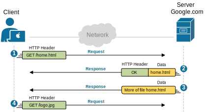

# Application Layer

The Application Layer sits at the very top of the OSI model, acting as the primary window for users and application services to access the network. Implemented by network applications, this layer is responsible for producing the data to be transferred and displaying the received information back to the user. It is important to note that software applications, such as web browsers, do not reside in this layer themselves; instead, they leverage Application Layer protocols—like **Http**, **SMTP**, **FTP**, and **DNS**—to enable the actual network communication.

## Standard Ports and Services
The following table outlines widely used Application Layer protocols, associating them with their designated port numbers and primary networking functions.

| Protocol                                       | Port Number(s)                 | Description                                                                                                                                       |
| ---------------------------------------------- | ------------------------------ | ------------------------------------------------------------------------------------------------------------------------------------------------- |
| **Domain Name System** (DNS)                   | 53                             | Translates internet names to their globally registered IP addresses. For example, "google.com" is registered in global DNS as IP address 8.8.8.8. |
| **Hypertext Transfer Protocol Secure** (HTTPS) | 443                            | Sends data to and from web browsers and web servers, but securely with the Secure Socket Layer (SSL) protocol.                                    |
| **File Transfer Protocol** FTP                 | 20, 21                         | Transfers files from a client to a server and vice versa.                                                                                         |
| **Secure Shell** (SSH)                         | 22                             | Connects to computers remotely and in a secure, encrypted way.                                                                                    |
| **Simple Mail Transfer Protocol** (SMTP)       | 25                             | Sends and receives email.                                                                                                                         |
| **Dynamic Host Configuration Protocol** (DHCP) | 67                             | Automatically assigns IP addresses to devices on a network.                                                                                       |
| **Internet Relay Chat** (IRC)                  | 194                            | Used in a client/server method. IRC clients communicate through an IRC server.                                                                    |
| **Post Office Protocol 3** (POP3)              | 110 (unsecured), 995 (secured) | Used for email where the client receives mail by downloading it locally to a computer from a server mailbox.                                      |

## HTTP
You can see that HTTP is **a client-server, request-response** protocol. A web browser sends a request like `GET` or `POST`. The server answers with a status code and the web page content.

Here's what happens in more detail:
- **Request (GET):** Your web browser sends an HTTP message to the web server. The message includes an HTTP header that says, *"GET /home.html."* If no file name is given, the server assumes you want the default page.
- **Response (OK):** The server replies with another HTTP message. The header includes a return code like HTTP 200 OK, meaning the request was successful. If there's an error (for example, page not found), the code might be 404 Not Found instead.
- **Data Transfer:** The server may send multiple messages containing parts of the requested file. To save space, only the first message includes an HTTP header; the rest just carry data.
- **Request (GET):** After opening the homepage, you most likely click on a link that leads you to another internal page. Subsequently, your web browser sends another request for that page. The server responds with the page, and so on.

---

[← Back to Main](../README.md) | [Previous: OSI Model Overview](./osi-model-overview.md) | [Next: Presentation and Session Layers →](./presentation-and-session-layers.md)
