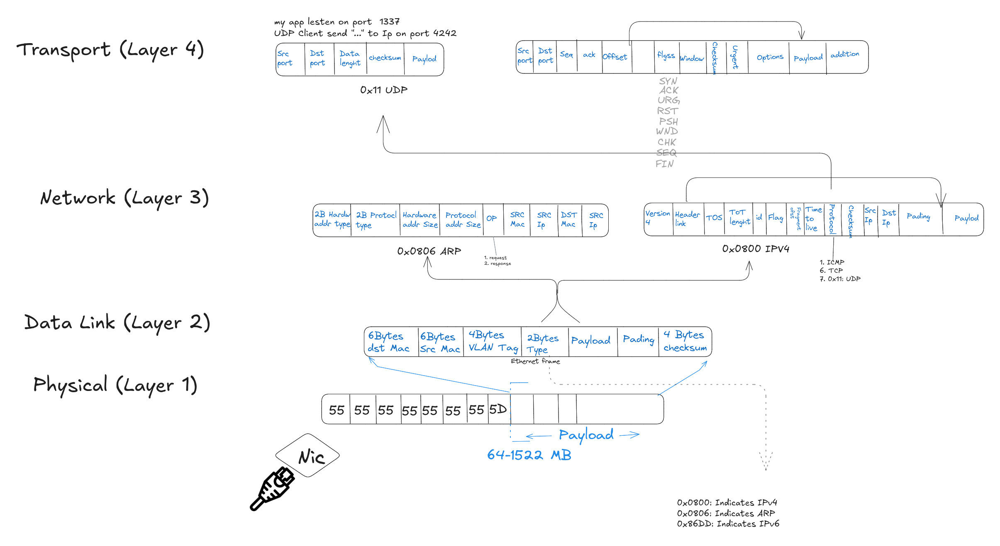

# Inside a Network Packet

In this diagram, I explain the anatomy of network packets by breaking down how data is encapsulated as it moves through the network stack, showing the role of headers, addresses, flags, and control fields at each layer, and how switches and routers use this information to forward, filter, or discard packets during transmission.

---

[← Back to Main](../README.md) | [Previous: Presentation and Session Layers](./presentation-and-session-layers.md) | [Next: TCP vs UDP →](./tcp-vs-udp.md)
