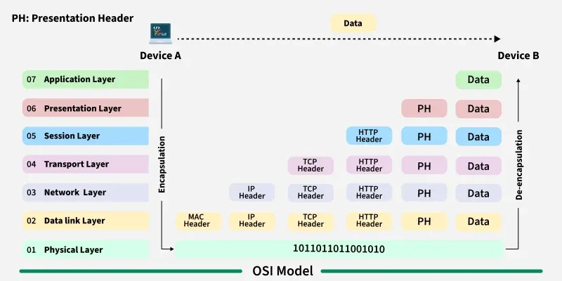

# Anatomy of Network-Packets

### How Data Flows in the OSI Model*?*

When we transfer information from one device to another, it travels through 7 layers of OSI model. First data travels down through 7 layers from the sender's end and then climbs back 7 layers on the receiver's end. Data flows through the OSI model in a step-by-step process:

- ****Application Layer:**** Applications create the data.
- ****Presentation Layer:**** Data is formatted and encrypted.
- ****Session Layer:**** Connections are established and managed.
- ****Transport Layer:**** Data is broken into segments for reliable delivery.
- ****Network Layer:**** Segments are packaged into packets and routed.
- ****Data Link Layer:**** Packets are framed and sent to the next device.
- ****Physical Layer:**** Frames are converted into bits and transmitted physically.

---

[← Back to Main](../README.md) | [Previous: VLANs](./vlans.md) | [Next: Application Layer →](./application-layer.md)
